# Blogs Platform

## Live URLs

- **API:** https://api.blogs123-platform.click/
- **Swagger UI:** https://api.blogs123-platform.click/api/docs/
- **Website:** https://blogs-platform-liart.vercel.app
- **Grafana CloudWatch Logs:** https://autorooter.grafana.net/dashboard/snapshot/HTVkTtcsxl8JH6ZJbnuURityyW5ZeUYh?orgId=0&from=2025-05-23T16:00:49.244Z&to=2025-05-25T16:00:49.244Z&timezone=browser&viewPanel=panel-1

- **Grafana Requests:** https://autorooter.grafana.net/dashboard/snapshot/IsBuIDyGRhUNkPLUm0TpQ3sXXqftQQ2e?orgId=0&from=2025-05-25T09:55:29.272Z&to=2025-05-25T15:55:29.272Z&timezone=browser&viewPanel=panel-1

A scalable blog platform built with the MERN stack (TypeScript) and AWS, featuring:

* **Authors** can create, and publish articles.
* **Admins** can manage users, view analytics, and import/export articles.
* **Readers(Users)** can browse articles, see reading-time estimates, and rate content.

---

## Solution Overview

This repository implements a production-ready system with real-time analytics, CI/CD, and full IaC:

* **Database:** MongoDB Atlas (free-tier) with import/export integration.
* **Backend/API:** Express.js (TypeScript) with JWT auth, role-based access, and Swagger docs.
* **Cloud/DevOps:** AWS Fargate (ECS) behind an ALB, Terraform for infra, GitHub Actions for CI/CD.
* **Frontend:** React (TypeScript) app deployed on Vercel with Tailwind UI and admin control panel.
* **Monitoring:** Grafana dashboards pulling from AWS CloudWatch metrics & logs.

---

## Getting Started Locally

### Prerequisites

* Node.js v18
* MongoDB Atlas cluster or local MongoDB
* AWS credentials (for Terraform)

### Backend

```bash
cd backend
cp .env.example .env      # set MONGODB_URI, JWT_SECRET
npm ci
npm run dev               # starts at http://localhost:5000
```

* API docs: [http://localhost:5000/api/docs](http://localhost:5000/api/docs)
* Runs Jest tests via `npm test`.

### Frontend

```bash
cd frontend
npm ci
npm run start               # starts at http://localhost:3000
```

* Logs in via `/login`, or register at `/register`.

---

## CI/CD & Deployment

### Backend

* **GitHub Actions:** runs tests, builds Docker image, pushes to Docker Hub, then runs `terraform apply`.
* **Terraform:** provisions VPC, ECS cluster, ALB, security groups, log group, and ECS Service.

### Frontend

* **Vercel:** configured to build from `frontend/`, runs only on merges to `main`.

---

## Requirement Selections

| Area             | Level | Details                                    |
| ---------------- | :---: | ------------------------------------------ |
| **Database**     |   L3  | MongoDB Atlas free-tier + import endpoint  |
| **Backend/API**  |   L4  | CI builds Docker image → pushes to Docker Hub → Terraform deploys to AWS Fargate(with ACM cert) |
| **Cloud/DevOps** |   L4  | Terraform IaC + GitHub Actions CI/CD       |
| **Frontend**     |   L6  | Full React app on Vercel + Admin panel     |
| **Monitoring**   |   L4  | Grafana dashboards from CloudWatch         |


---

## Repository Structure

```
/backend       # Express API, controllers, models, tests
/frontend      # React app with pages, components, Tailwind
/terraform     # Terraform code for AWS infra
/.github       # CI/CD workflow definitions
README.md      
```

---

## Environment Variables

| Name                     | Description                                |
| ------------------------ | ------------------------------------------ |
| MONGODB\_URI             | MongoDB connection string (Atlas or local) |
| JWT\_SECRET              | Secret for signing JWT tokens              |
| AWS\_ACCESS\_KEY\_ID     | AWS credentials for Terraform              |
| AWS\_SECRET\_ACCESS\_KEY | AWS credentials for Terraform              |

---
## Screenshots
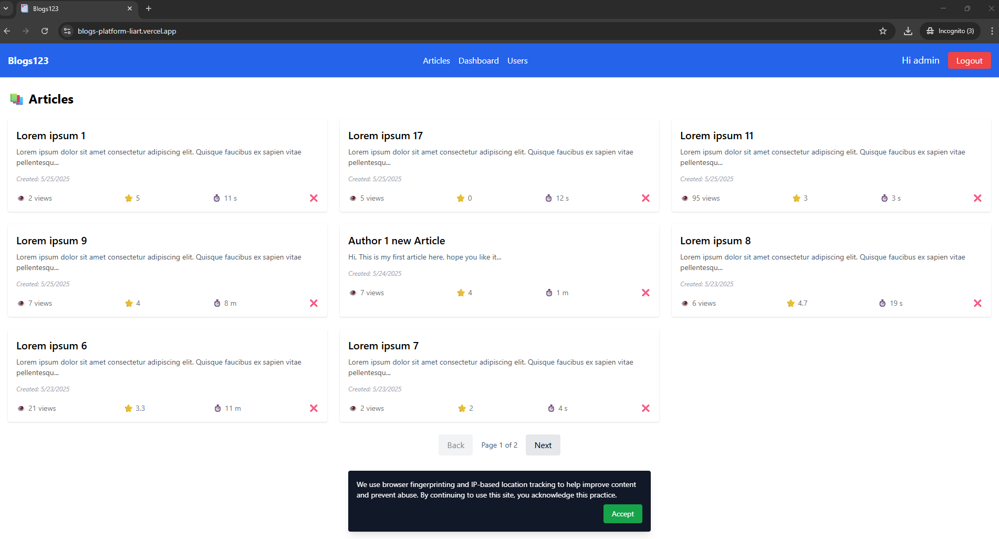
<br><br>
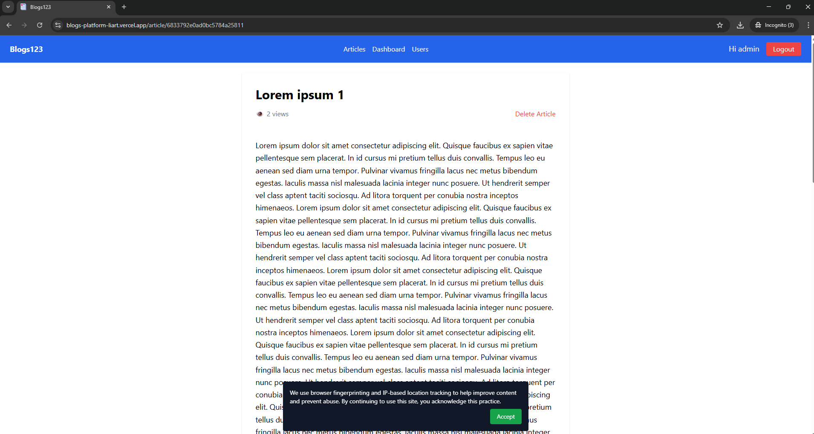
<br><br>
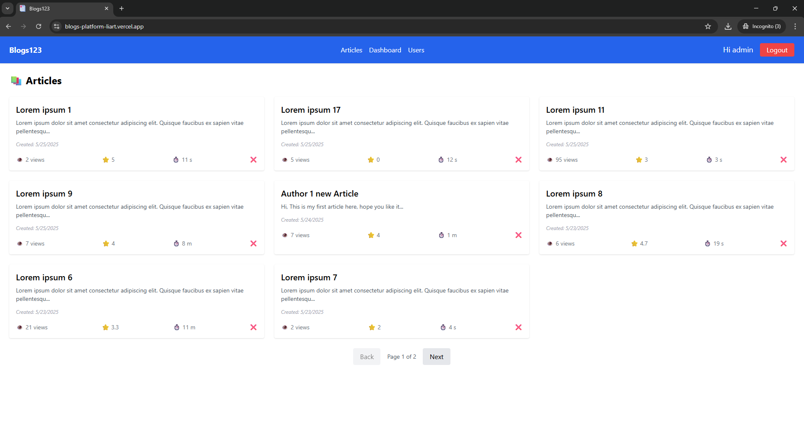
<br><br>
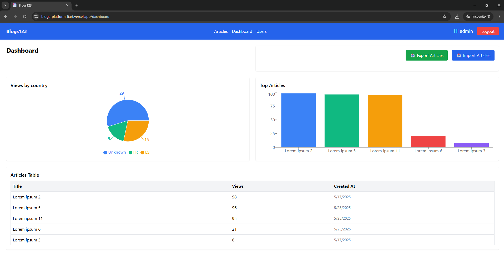
<br><br>
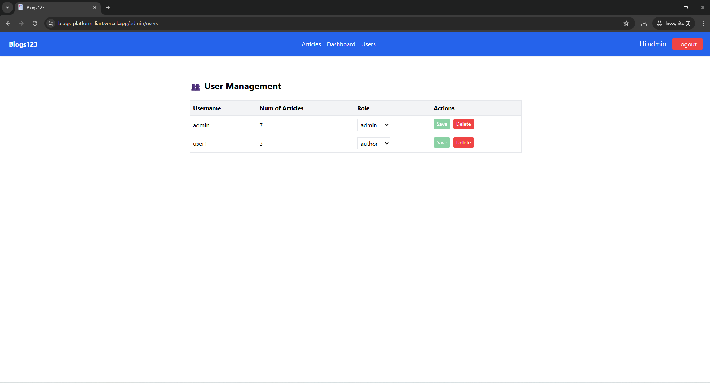
<br><br>
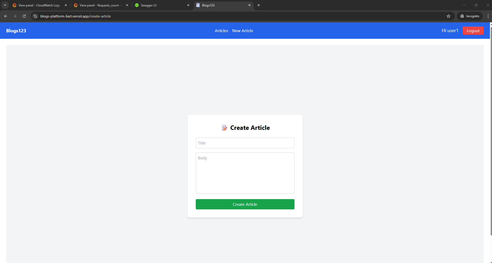
<br><br>
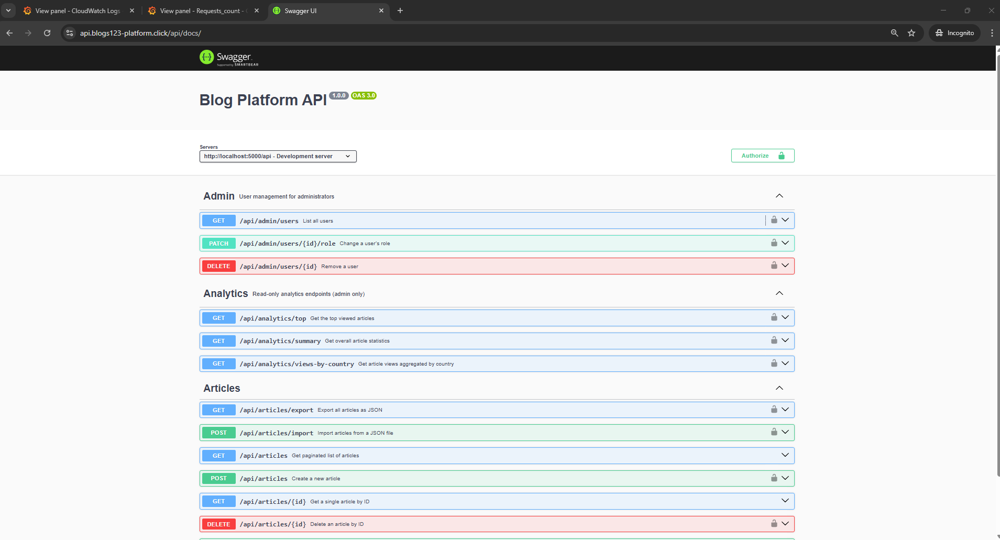
<br><br>
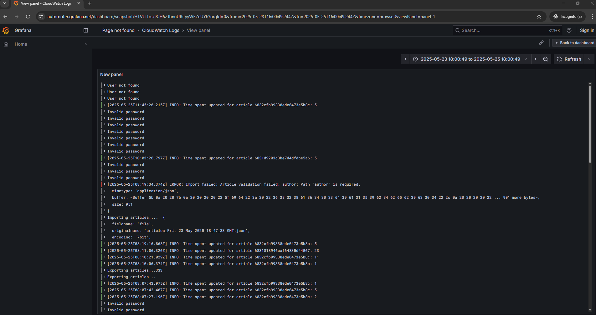
<br><br>
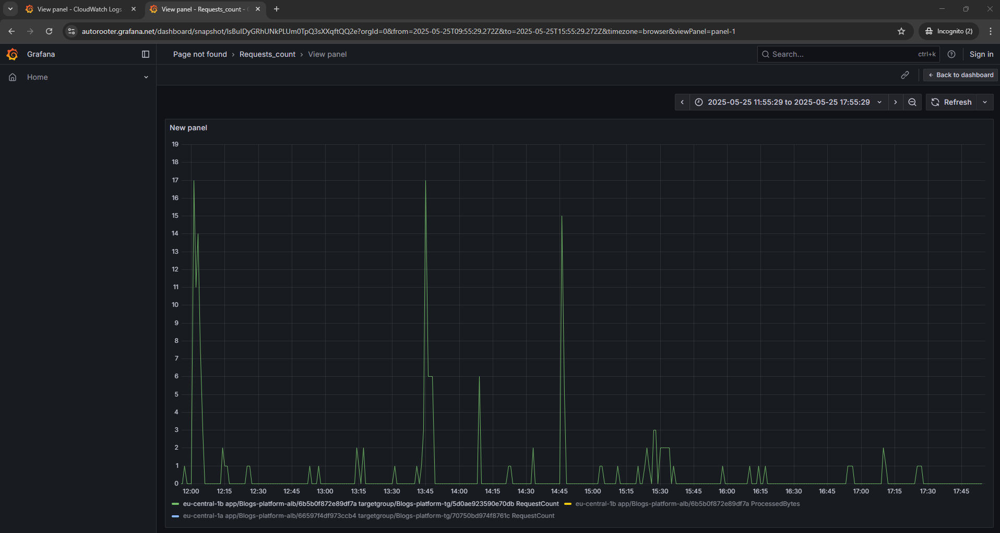
<br><br>
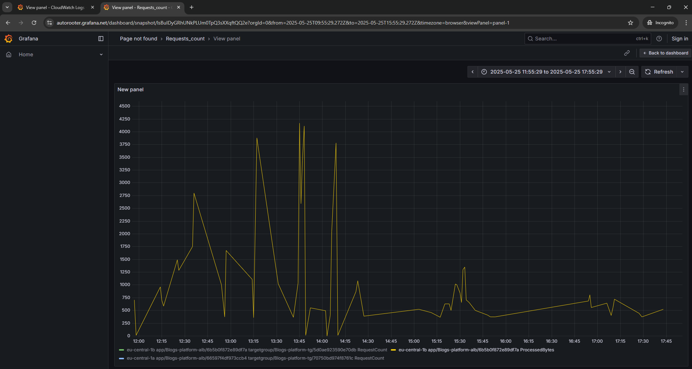
<br><br>
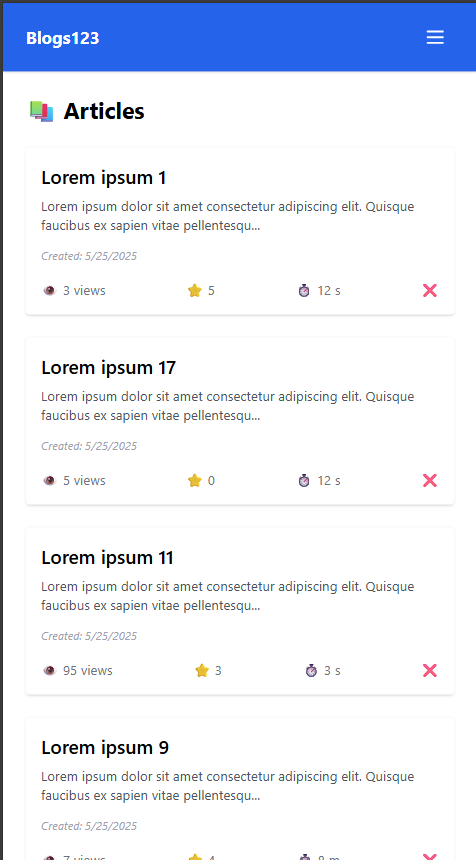
<br><br>
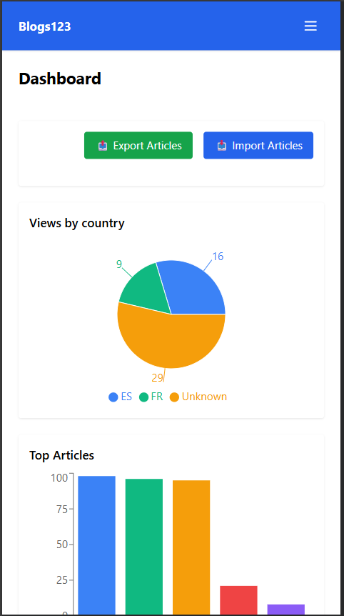